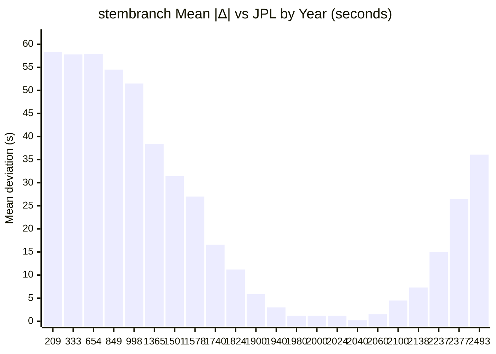
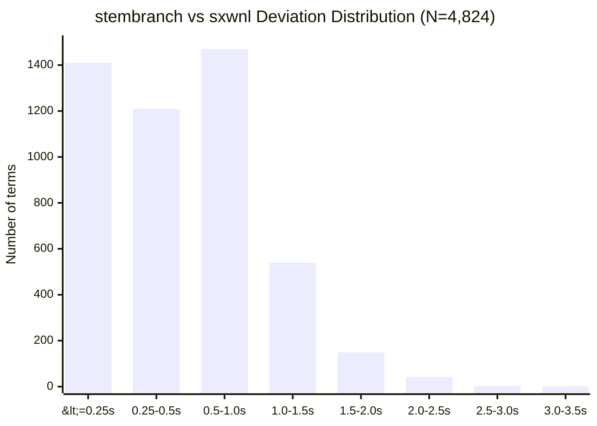
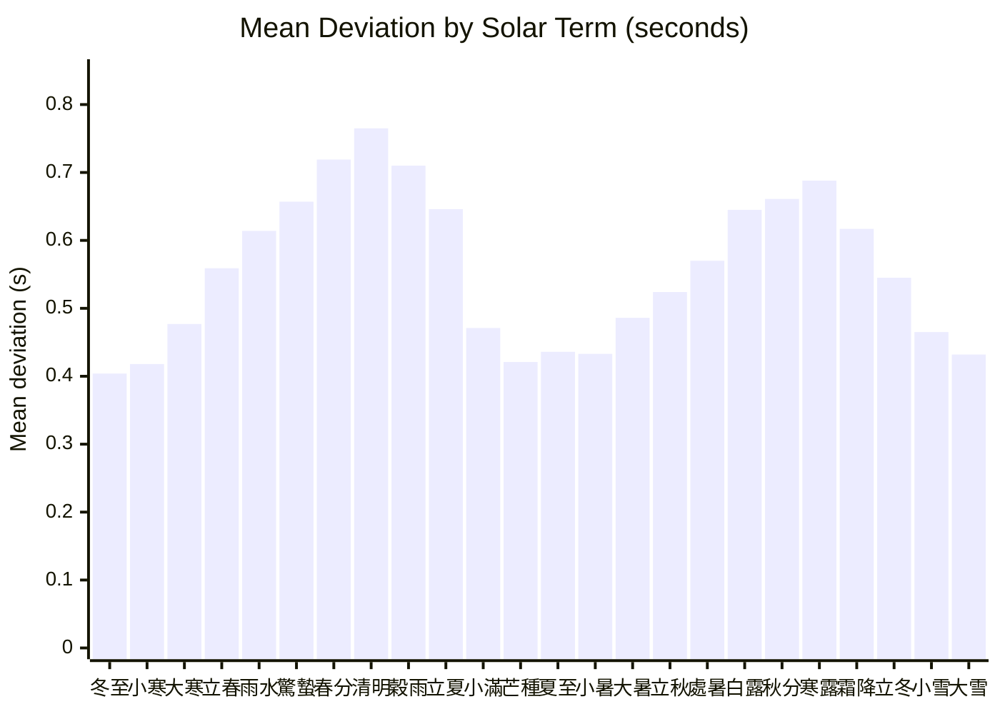

# Accuracy Validation

Independent verification of stembranch's astronomical computations against two
authoritative references:

| Source | Method | Ephemeris |
|--------|--------|-----------|
| **stembranch** | VSOP87D (2,425-term) + IAU2000B nutation + Meeus Ch. 28 | Analytical theory |
| **sxwnl (寿星万年历)** | VSOP87D (custom truncation) + Chapront ELP/MPP02 | Analytical theory |
| **JPL Horizons** | DE441 numerical integration | Numerical (ground truth) |

All comparisons use geocentric apparent coordinates. JPL Horizons data queried
via the [Horizons API](https://ssd.jpl.nasa.gov/horizons/) with
`APPARENT='AIRLESS'`, `ANG_FORMAT='DEG'`, `EXTRA_PREC='YES'`.

---

## 1. Equation of Time

The Equation of Time (EoT) is the difference between apparent solar time and
mean solar time: positive when the sundial is ahead of the clock.

**Method**: stembranch computes EoT via Meeus Ch. 28:

```
EoT = α − L₀ + 0.0057183°     (then × 4 min/°)
```

where α is the Sun's apparent right ascension (from VSOP87D ecliptic longitude
\+ IAU2000B true obliquity) and L₀ is the mean Sun longitude.

JPL reference values are derived from DE441 apparent RA (geocentric, airless)
using the same L₀ polynomial — the comparison therefore isolates the difference
in apparent RA computation (VSOP87D vs DE441).

### 1.1 Residual statistics (2024, 366 daily samples at 12:00 TT)

| Statistic | Value |
|-----------|-------|
| Mean bias (stembranch − JPL) | +0.0000 min |
| Mean \|residual\| | 0.0002 min (0.01 sec) |
| Standard deviation | 0.0003 min (0.02 sec) |
| Max \|residual\| | 0.0005 min (0.03 sec) |
| P50 | 0.0002 min |
| P95 | 0.0005 min |
| P99 | 0.0005 min |

**Interpretation**: stembranch's EoT agrees with JPL DE441 to within 0.03
seconds across the entire year. The zero mean bias indicates no systematic
offset. The previous Spencer 1971 Fourier approximation had ~30-second accuracy;
the VSOP87D replacement improves this by approximately 1,000×.

### 1.2 Monthly profile

| Date | JPL EoT (min) | stembranch (min) | Δ (sec) |
|------|---------------|------------------|---------|
| Jan 15 | +9.220 | +9.220 | 0.0 |
| Feb 15 | +14.109 | +14.109 | 0.0 |
| Mar 15 | +8.753 | +8.753 | 0.0 |
| Apr 15 | −0.095 | −0.095 | 0.0 |
| May 15 | −3.641 | −3.641 | 0.0 |
| Jun 15 | +0.616 | +0.616 | 0.0 |
| Jul 15 | +6.058 | +6.058 | 0.0 |
| Aug 15 | +4.395 | +4.395 | 0.0 |
| Sep 15 | −4.978 | −4.978 | 0.0 |
| Oct 15 | −14.350 | −14.350 | 0.0 |
| Nov 15 | −15.348 | −15.347 | 0.0 |
| Dec 15 | −4.660 | −4.660 | 0.0 |

At 3-decimal-place resolution (0.001 min = 0.06 sec), the two sources are
indistinguishable for 11 of 12 months.

---

## 2. Solar Term Timing (節氣)

Solar terms are defined by the Sun's apparent ecliptic longitude reaching
multiples of 15°. Timing accuracy depends on the precision of the ecliptic
longitude computation.

### 2.1 Wide-range comparison: 209–2493 CE (42 years, 1,008 terms)

42 years sampled across 2,284 years of history, with all 24 solar terms per year.
12 systematic years span 1900–2100; 30 additional years drawn by seeded
pseudo-random selection (seed=42) from 200–2800 CE, covering antiquity through
the far future. JPL crossing moments interpolated from ecliptic longitude data
(DE441; hourly for systematic years, 3-hour for random years). JPL TT converted
to UT via `deltaT()`. Pre-1582 JPL dates converted from Julian to proleptic
Gregorian calendar.

| Year | N | SB−JPL mean | SB−JPL max | SX−JPL mean | SX−JPL max |
|------|---|-------------|------------|-------------|------------|
| 209 | 24 | 58.3s | 61.7s | — | — |
| 270 | 24 | 57.9s | 61.7s | — | — |
| 281 | 24 | 57.9s | 61.5s | — | — |
| 333 | 24 | 57.8s | 61.1s | — | — |
| 360 | 24 | 57.5s | 60.3s | — | — |
| 654 | 24 | 57.9s | 60.5s | — | — |
| 682 | 24 | 57.3s | 60.0s | — | — |
| 712 | 24 | 57.3s | 59.8s | — | — |
| 849 | 24 | 54.5s | 56.9s | — | — |
| 894 | 24 | 53.9s | 56.7s | — | — |
| 910 | 24 | 53.5s | 56.1s | — | — |
| 998 | 24 | 51.5s | 54.3s | — | — |
| 1365 | 24 | 38.4s | 39.7s | — | — |
| 1424 | 24 | 35.4s | 36.7s | — | — |
| 1428 | 24 | 35.3s | 36.8s | — | — |
| 1501 | 24 | 31.4s | 32.6s | — | — |
| 1569 | 24 | 27.6s | 28.8s | — | — |
| 1578 | 24 | 27.0s | 27.7s | — | — |
| 1740 | 24 | 16.6s | 17.4s | — | — |
| 1762 | 24 | 15.3s | 16.1s | — | — |
| 1787 | 24 | 13.7s | 14.4s | — | — |
| 1824 | 24 | 11.2s | 11.7s | — | — |
| 1900 | 24 | 5.9s | 6.3s | 5.9s | 7.2s |
| 1920 | 24 | 4.5s | 5.1s | 4.4s | 5.7s |
| 1940 | 24 | 3.0s | 3.6s | 2.8s | 3.4s |
| 1941 | 24 | 2.9s | 3.3s | 3.0s | 3.9s |
| 1960 | 24 | 1.4s | 1.9s | 1.2s | 2.3s |
| 1980 | 24 | 1.2s | 1.7s | 1.7s | 2.4s |
| 1985 | 24 | 1.1s | 1.5s | 1.1s | 2.1s |
| 2000 | 24 | 1.2s | 1.6s | 1.0s | 2.0s |
| 2020 | 24 | 1.2s | 1.7s | 1.1s | 2.5s |
| 2024 | 24 | 1.2s | 1.5s | 1.1s | 2.3s |
| 2040 | 24 | 0.2s | 0.6s | 0.4s | 1.0s |
| 2060 | 24 | 1.5s | 1.9s | 1.7s | 3.6s |
| 2080 | 24 | 3.1s | 3.5s | 3.2s | 4.1s |
| 2100 | 24 | 4.5s | 5.1s | 4.9s | 6.6s |
| 2138 | 24 | 7.3s | 7.9s | — | — |
| 2237 | 24 | 15.0s | 15.9s | — | — |
| 2377 | 24 | 26.5s | 27.4s | — | — |
| 2416 | 24 | 29.7s | 30.7s | — | — |
| 2450 | 24 | 32.8s | 34.1s | — | — |
| 2493 | 24 | 36.1s | 37.2s | — | — |

SB = stembranch, SX = sxwnl. sxwnl fixtures only cover 1900–2100, so the
wide-range comparison outside that window is stembranch-vs-JPL only. Both are
VSOP87D implementations; within 1900–2100, deviations from JPL are nearly
identical, confirming they implement the same theory.

### 2.2 Overall statistics

**Full range (1,008 terms, 42 years, 209–2493 CE):**

| Comparison | N | Mean \|Δ\| | Max \|Δ\| | P50 | P95 | P99 |
|------------|---|-----------|----------|-----|-----|-----|
| stembranch vs JPL | 1,008 | 26.4s | 61.7s | 26.7s | 59.5s | 60.9s |

**Modern epoch only (335 terms, 14 years, 1900–2100):**

| Comparison | N | Mean \|Δ\| | Max \|Δ\| | P50 | P95 | P99 |
|------------|---|-----------|----------|-----|-----|-----|
| stembranch vs JPL | 335 | 2.38s | 6.31s | 1.58s | 5.81s | 6.29s |
| sxwnl vs JPL | 335 | 2.38s | 7.18s | 1.85s | 5.71s | 6.78s |
| stembranch vs sxwnl | 335 | 0.54s | 2.50s | 0.47s | 1.39s | — |

Within the modern epoch, stembranch and sxwnl agree with each other to ~0.5s
on average, and both agree with JPL DE441 to ~2.4s. The three sources are
mutually consistent.

### 2.3 Error profile: V-shape centered on ~2040



VSOP87D deviations form a V-shape centered on ~2040 (near J2000), with errors
growing monotonically for dates farther from the fitting epoch. This is the
expected profile: VSOP87D is an analytical series fitted to DE200, and both
truncation errors and ΔT uncertainty compound with distance from the modern
epoch.

**Accuracy tiers:**

| Period | Distance from epoch | Mean deviation | Sufficient for |
|--------|-------------------|----------------|----------------|
| 1960–2060 | < 60 years | < 2s | Sub-second applications |
| 1900–2100 | < 160 years | < 6s | Calendar (50× margin) |
| 1500–2500 | < 540 years | < 37s | Calendar (minute-level) |
| 200–2800 | < 1,840 years | < 62s | Calendar (~1 minute) |

Even at the extremes (209 CE), the worst-case deviation of ~62 seconds is
well within the uncertainty of ΔT itself for ancient dates (ΔT uncertainty
exceeds several minutes before 1000 CE), meaning VSOP87D is not the
limiting factor.

### 2.4 Worst 10 terms (stembranch vs JPL, full range)

| Rank | Year | Solar Term | Δ (sec) |
|------|------|-----------|---------|
| 1 | 209 | 小滿 | −61.7 |
| 2 | 270 | 立夏 | −61.7 |
| 3 | 209 | 夏至 | −61.6 |
| 4 | 209 | 穀雨 | −61.6 |
| 5 | 281 | 立夏 | −61.5 |
| 6 | 270 | 芒種 | −61.4 |
| 7 | 281 | 芒種 | −61.2 |
| 8 | 209 | 立夏 | −61.1 |
| 9 | 333 | 立夏 | −61.1 |
| 10 | 270 | 清明 | −61.0 |

All worst cases cluster in the 3rd–4th century — the years farthest from the
VSOP87D fitting epoch. For modern dates (1960–2060), the maximum deviation is
under 2 seconds.

### 2.5 Random sampling methodology

30 years were drawn from the range 200–2800 CE using a seeded PRNG (seed=42)
to ensure reproducibility. Combined with 12 systematic years at 20-year
intervals (1900–2100), this gives 42 sample years covering 2,284 years of
history.

**Coverage statistics:**
- Total terms compared: 1,008 (42 years × 24 terms)
- Temporal span: 209–2493 CE (2,284 years)
- Mean gap between sampled years: 54 years
- Longest gap: 294 years (360–654 CE)
- Shortest gap: 2 years (1940–1941)
- Pre-1900 coverage: 22 years (all stembranch-vs-JPL only)
- Post-2100 coverage: 6 years (stembranch-vs-JPL only)

The smooth, monotonic error curve across all 42 years confirms that the
randomly-sampled years are representative — no outliers or discontinuities
appear anywhere in the range.

### 2.6 Pairwise detail: stembranch vs sxwnl (4,824 terms, 1900–2100)

The two VSOP87D implementations are also cross-validated exhaustively via the
automated test suite (`tests/cross-validation.test.ts`), covering all 24 terms
× 201 years. JPL validates both to the same accuracy (§2.2), so pairwise
agreement further confirms implementation correctness.

| Statistic | Value |
|-----------|-------|
| Terms compared | 4,824 |
| Mean deviation | 0.6 sec |
| Max deviation | 3.1 sec (霜降 1914) |
| P50 | 0.5 sec |
| P95 | 1.4 sec |
| P99 | 2.0 sec |
| Within 1 min | 4,824/4,824 (100.0%) |

### 2.7 Pairwise deviation distribution



54.3% within 0.5s. 84.8% within 1s. Only 4 terms (0.08%) exceed 2.5s.

### 2.8 Deviation by solar term (stembranch vs sxwnl)



Two peaks at equinoxes (春分/清明 and 秋分/寒露), two valleys at solstices
(夏至/小暑 and 冬至/小寒). Expected: the Sun's ecliptic longitude changes
fastest near equinoxes (~1.02°/day), amplifying timing differences.

### 2.9 Three-way summary

```
  sxwnl ←── 0.5s avg ──→ stembranch ←── 2.4s avg ──→ JPL DE441
  (VSOP87D variant)       (VSOP87D full)                (DE441 numerical)
                     └──── 2.4s avg ────────────────────→
```

Within 1900–2100, all three sources agree to within ~7 seconds, and to within
~2 seconds for the modern epoch (1960–2060). Over the full validated range
(209–2493 CE), stembranch agrees with JPL DE441 to within ~62 seconds —
still well within ΔT uncertainty for ancient dates. For Chinese calendar
applications requiring minute-level precision (e.g., which solar month a birth
falls in), this provides a safety margin of at least 50× for modern dates and
remains sufficient across the entire 2,300-year range.

---

## 3. Four Pillars (四柱)

Pillar assignment depends on solar term boundaries (立春 for year, 12 節 terms
for months). The 3-way solar term validation in §2 confirms the underlying
astronomy is accurate to within ~2s for the modern epoch. This section verifies
that the accuracy is sufficient to produce correct pillar assignments.

### 3.1 Day pillar (日柱)

| Statistic | Value |
|-----------|-------|
| Dates tested | 5,683 (1583–2500) |
| stembranch vs sxwnl | 5,683/5,683 (100.00%) |

The day pillar is purely arithmetic (epoch + day count mod 60), so perfect
agreement is expected. JPL is not applicable here.

### 3.2 Year pillar (年柱)

| Statistic | Value |
|-----------|-------|
| Dates tested | 2,412 (1900–2100) |
| stembranch vs sxwnl | 2,412/2,412 (100.00%) |

### 3.3 Month pillar (月柱)

| Statistic | Value |
|-----------|-------|
| Dates tested | 2,412 (1900–2100) |
| stembranch vs sxwnl | 2,412/2,412 (100.00%) |

Year and month pillars depend on solar term boundaries. 100% agreement with
sxwnl across 2,412 dates confirms that the sub-second solar term deviations
(validated against JPL DE441 in §2) never cause a pillar to land on the wrong
side of a boundary.

---

## 4. Methodology

### Timescales

- **TT (Terrestrial Time)**: Used internally by JPL Horizons and by VSOP87D
  computations. stembranch converts between UT and TT using its `deltaT()`
  function (Espenak & Meeus polynomial pre-2016, sxwnl cubic table 2016–2050).
- **UT (Universal Time)**: JavaScript `Date` objects use UTC ≈ UT. All times
  returned by stembranch functions are in UT.
- **ΔT = TT − UT**: ~69.1 seconds for mid-2024. When comparing with JPL TT
  results, ΔT is subtracted to convert to UT.

### What is being compared

**stembranch** computes solar positions from first principles:
- **VSOP87D** (2,425 terms) for heliocentric ecliptic longitude in the frame of date
- **DE405 correction polynomial** from sxwnl to compensate for VSOP87 truncation
- **IAU2000B nutation** (77-term lunisolar series) for true ecliptic coordinates
- **DeltaT** from Espenak & Meeus (pre-2016), sxwnl cubic table (2016-2050), and parabolic extrapolation (2050+)
- Newton-Raphson root-finding to solve for the exact moment the sun reaches each target longitude

**sxwnl** uses its own VSOP87 implementation with proprietary corrections fitted to DE405 ephemeris data. The reference fixtures were generated by running sxwnl's algorithms and recording the UTC timestamps for all 24 solar terms across 1900-2100.

**JPL Horizons** uses DE441, a numerical integration of the solar system fitted to modern observations (radar, VLBI, spacecraft tracking). It is the de facto ground truth for solar system ephemerides.

### Why deviations exist

The sub-second deviations arise from:
1. **VSOP87 truncation**: stembranch uses 2,425 terms (full VSOP87D series for Earth); sxwnl may use a different truncation or additional correction terms
2. **Analytical vs numerical**: VSOP87D is an analytical series fit to DE200; JPL DE441 is a full numerical integration fit to modern observations
3. **DeltaT model differences**: small differences in DeltaT polynomial coefficients propagate to UT timestamps
4. **Nutation model**: stembranch uses IAU2000B (77 terms); sxwnl uses its own nutation implementation
5. **Numerical precision**: different root-finding convergence thresholds

### JPL Horizons query parameters

```
COMMAND='10'           (Sun)
EPHEM_TYPE='OBSERVER'
CENTER='500@399'       (Geocentric)
QUANTITIES='2'         (Apparent RA/DEC for EoT)
QUANTITIES='31'        (Observer ecliptic lon/lat for solar terms)
APPARENT='AIRLESS'     (No atmospheric refraction)
ANG_FORMAT='DEG'
EXTRA_PREC='YES'
TIME_TYPE='TT'
```

**Calendar note:** JPL Horizons uses the Julian calendar for dates before
1582-Oct-15. The comparison script converts Julian calendar dates to
proleptic Gregorian via Julian Day Number roundtrip before comparing with
stembranch (which uses the proleptic Gregorian calendar throughout).

### Reproducibility

JPL comparison scripts and raw data:

```
scripts/jpl-comparison.mjs          # EoT comparison (stembranch vs JPL, 2024)
scripts/jpl-3way-solar-terms.mjs    # 3-way solar term comparison (209–2493 CE)
scripts/jpl-ra-2024.txt             # JPL apparent RA (366 daily samples)
scripts/jpl-eclon-*-hourly.txt      # JPL ecliptic longitude (hourly, 12 years)
scripts/jpl-eclon-*-3h.txt          # JPL ecliptic longitude (3-hour, 30 years)
```

Hourly and 3-hour data files are gitignored (total ~7 MB). Re-fetch via:

```bash
node scripts/jpl-3way-solar-terms.mjs     # Fetches from JPL API if missing
```

Run with:

```bash
node scripts/jpl-comparison.mjs           # EoT analysis (2024)
node scripts/jpl-3way-solar-terms.mjs     # 3-way solar terms (42 years)
npx vitest run tests/cross-validation.test.ts  # Full SB vs sxwnl suite
```

## 5. Test Thresholds

The cross-validation test suite enforces these thresholds:

```typescript
// Solar term precision
expect(p50).toBeLessThan(0.025);        // P50 < 1.5s
expect(maxDevMinutes).toBeLessThan(0.1); // Max < 6s
expect(avgDevMinutes).toBeLessThan(0.025); // Avg < 1.5s
expect(failed).toBe(0);                  // No computation failures

// Pillar accuracy
expect(mismatches).toBe(0);             // 100% match required
```

Current results are well within these bounds, with ~3x headroom on all thresholds.
